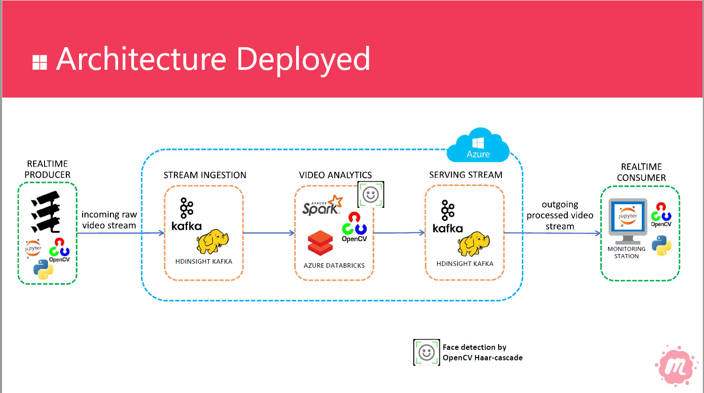

# Video Processing Demo

This demonstration is based on the following scenario:
* You have hundreds of cameras you need to process real time to identify any public security threat
* You need frame-by-frame image processing analytics to be applied
* All images need to be served in near realtime to a monitoring station

To implement this scenario, the following component architecture was deployed:



The demonstrations use several open source technologies such as:
* Apache Kafka
* Apache Spark
* OpenCV


## Environment setup
To be able to replicate the environment, we need three main components:

### 1. Video Producer and Consumer
This can be your desktop. In the demonstration we used a windows laptop with built in camera. The producer was written in Python, running on a jupyter environment. [Here](http://jupyter.readthedocs.io/en/latest/install.html) you can find instructions on how to install jupyter.

We also need a consumer code, so we can see the results of the analytics applied to the video. We are also running this code in the jupyter environment.


### 2. Stream ingestion and serving
All video streams are ingested and served using Apache Kafka. In the demonstration we used [Azure HDInsight with Kafka](https://docs.microsoft.com/en-us/azure/hdinsight/kafka/apache-kafka-introduction). You can find instructions on how to instantiate Kafka on Azure [here](https://docs.microsoft.com/en-us/azure/hdinsight/kafka/apache-kafka-get-started). As you create your Kafka cluster, make sure to create it under a virtual network (vnet). Make sure to allow automatic topic creation to ease setting up the environment--instructions [here](https://docs.microsoft.com/en-us/azure/hdinsight/kafka/apache-kafka-auto-create-topics).

After completing the cluster creation, you will need to setup secure communication from your Video Producer to the Kafka cluster via VPN point-to-site. See instructions [here](https://docs.microsoft.com/en-us/azure/hdinsight/kafka/apache-kafka-connect-vpn-gateway).


### 3. Stream Analytics
Once we have video stream available on Kafka, we need to subscribe to Kafka to get the stream and apply the Video Analytics. We are using Apache Spark with [Structured Streaming](https://spark.apache.org/docs/2.3.0/structured-streaming-programming-guide.html) so we can achieve low latency streaming jobs.

For this demonstration, we are using [Azure Databricks](https://docs.microsoft.com/en-us/azure/azure-databricks/what-is-azure-databricks), which is a managed and easy to use Spark environment. See [here](https://docs.microsoft.com/en-us/azure/azure-databricks/quickstart-create-databricks-workspace-portal) instructions on how to create a Databricks service on Azure. And finally, we need to make sure both virtual networks from Kafka and Databricks have connectivity. This is done through vnet peering, described in this [article](https://docs.azuredatabricks.net/administration-guide/cloud-configurations/azure/vnet-peering.html).


## Import the code and run

Once the environment is setup, we are ready to import all sample code and start testing this architecture.

First, you can find under the `jupyter` folder two notebooks you can import into your jupyter instalation.
1. `VideoCaptureToKafka`: this notebook will use OpenCV to access your camera, and for each frame it will post into a Kafka topic.
2. `KafkaConsumerProcessed`: this notebook will subscribe to a Kafka topic, and for each frame it will display as a separate window using OpenCV.

To run this code, make sure you update accordingly your `kafkabrokers` variable and import all dependencies into your jupyter/python environment via pip.

```python
!pip install opencv-python
!pip install kafka-python```


Second, you will find one databricks notebook under the `databricks` folder. The `KafkaStructStream` notebook is a Spark Structured Streaming job that will consume a Kafka topic, perform the face detection using OpenCV on each frame, and write back to another Kafka topic.

Import this notebook into Databricks. Instructions [here](https://docs.azuredatabricks.net/user-guide/notebooks/index.html#import-a-notebook). Make sure to update the `kafka.bootstrap.servers` variable, and import all python dependencies using:

```python
!pip install opencv-python
!pip install kafka-python```